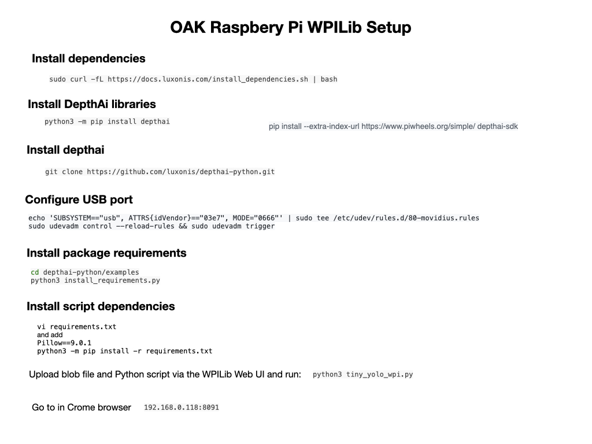

# Depthai & OpenVino

Depthai install files:

`~/depthai`

>`resources/nn` contain the model json files.  When these run they download the blobs into: `~/.cache/blobconverter/`

## Converting to Blob

Use the [Online Blob Converter](http://blobconverter.luxonis.com)

Or install locally:

    python3 -m pip install -U blobconverter

To convert:

    python3 -m blobconverter --openvino-xml /path/to/custom_model.xml --openvino-bin /path/to/custom_model.bin

## References
- [Depthai Documentation](https://docs.luxonis.com/en/latest/)
- [OpenVino Notebooks](https://github.com/openvinotoolkit/openvino_notebooks)

## Errors
-- Configuring incomplete, errors occurred!
See also "/Users/martinwhite/DepthAI/depthai-python/build/CMakeFiles/CMakeOutput.log".
See also "/Users/martinwhite/DepthAI/depthai-python/build/CMakeFiles/CMakeError.log".