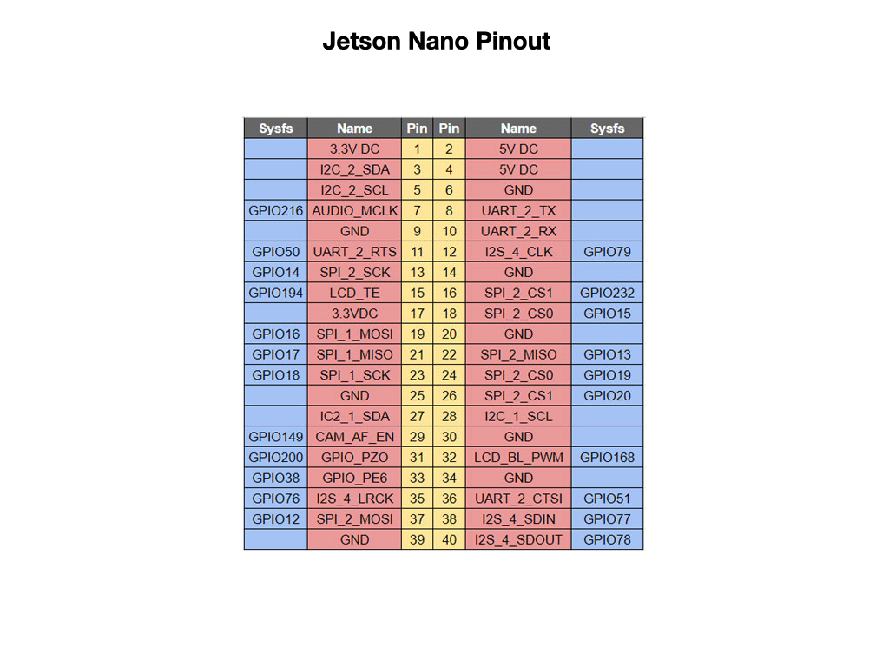
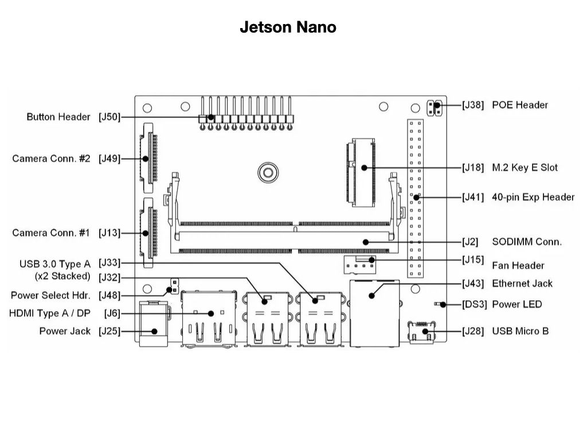

# Jetson Nano

## Install ROS2 on Jetson
Make sure that docker is installed first and then use the docker image [jetbot_ros](github.com/dusty-nv/jetbot_ros)

    cd ~
    git clone https://github.com/dusty-nv/jetbot_ros
    cd jetbot_ros
    docker/run.sh

This will download the docker image the first time.

Create a workspace directory:

    mkdir dev_ws/src

Edit the script `~/jetbot_ros/docker/run.sh `that starts the container, and add the following line:

    -v $HOME/dev_ws:/dev_ws \

Stop and restart the container by exiting the container and then:

    cd ~/jetbot_ros
    docker/run.sh

There will be a directory `/dev_ws` where you can create your packages and they will persist across container restarts.    

Test:

    ros2 run demo_nodes_py talker
    ros2 run demo_nodes_py listener

Launch Gazebo:

    ros2 launch jetbot_ros gazebo_world.launch.py

Launch a new terminal session into the container:

    sudo docker exec -it jetbot_ros /bin/bash      

Build a single package:

    colcon build --packages-select rover_teleop --symlink-install

## Install wpilib-ws-robot-romi on Jetson

First install Node Package Manager.

    curl -sL https://deb.nodesource.com/setup_14.x | sudo -E bash -

    sudo apt install nodejs

Then install robot code by cloning the wpilib-ws-robot-romi repository and then use `npm` to install the dependencies that are in the `package.json` file:

    git clone https://github.com/wpilibsuite/wpilib-ws-robot-romi.git

    cd wpilib-ws-robot-romi

    npm install

Get ubuntu version:

    lsb_release -a 

Show jetpack version:

    sudo apt-cache show nvidia-jetpack

Get processor info:

    cat /proc/cpuinfo
    
Check power mode settings: `nvpmodel -q`. When MAXN is displayed, the maximum operation mode is selected.

### Install VSCode

[How to install VSCode](https://www.forecr.io/blogs/programming/how-to-install-visual-studio-code-on-nvidia-jetson-xavier-nx-nano-run-sample-in-c-application) on Jetson Nano.

# References

- [Setup Jetson from Machine Learning](https://jkjung-avt.github.io/jetpack-4.6/) - JK Jung Blog