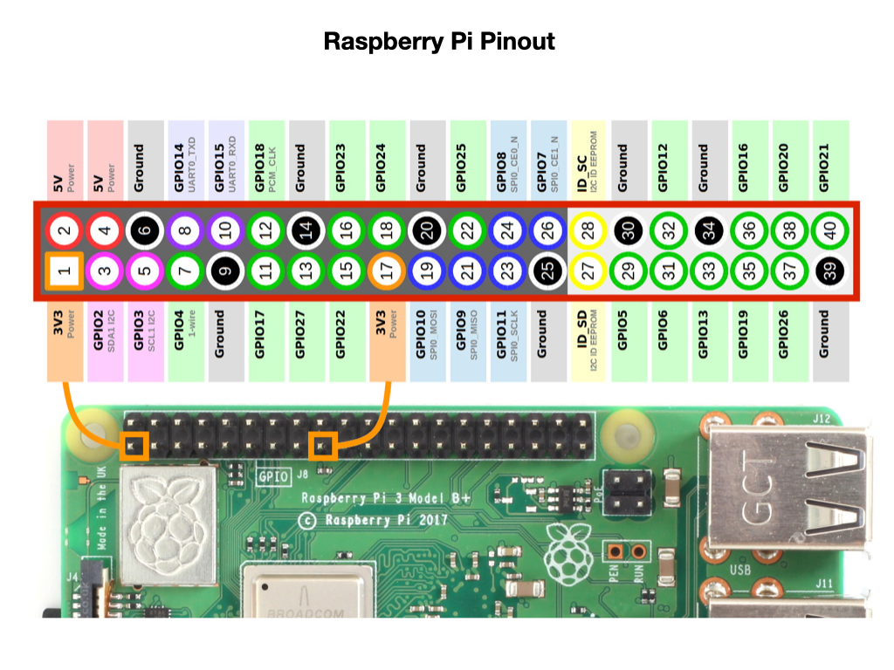

# Raspberry Pi

### Pinout

### Use with LG Monitor
edit the `/boot/config.txt` file an set the following parameters:

    hdmi_force_hotplug=1
    config_hdmi_boost=4
    hdmi_group=1

## Remote Access
[Remote Access](https://www.raspberrypi.com/documentation/computers/remote-access.html#secure-shell-from-linux-or-mac-os)

# References