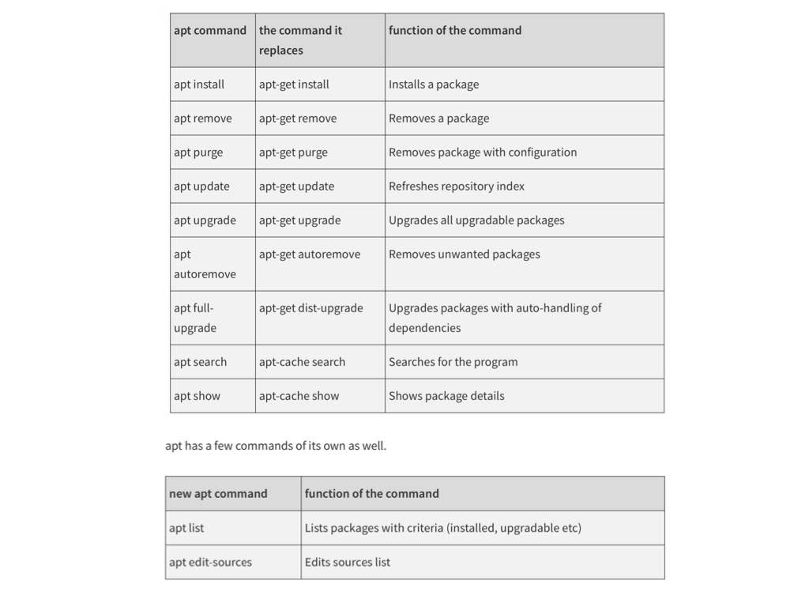

# apt Package Manager

Is replaced with `apt` that consists some of the most widely used features from `apt-get` and `apt-cache` leaving aside obscure and seldom used features.  See this [Apt Command guide](https://itsfoss.com/apt-command-guide/).

To keep your system clean by removing unused packages you can run:

    sudo apt autoremove

## References
- [apt vs apt-get](https://itsfoss.com/apt-vs-apt-get-difference/)

- [Apt Command guide](https://itsfoss.com/apt-command-guide/)

- [apt-get Cheat Sheet](http://chenweixiang.github.io/docs/apt_cheat_sheet.pdf)