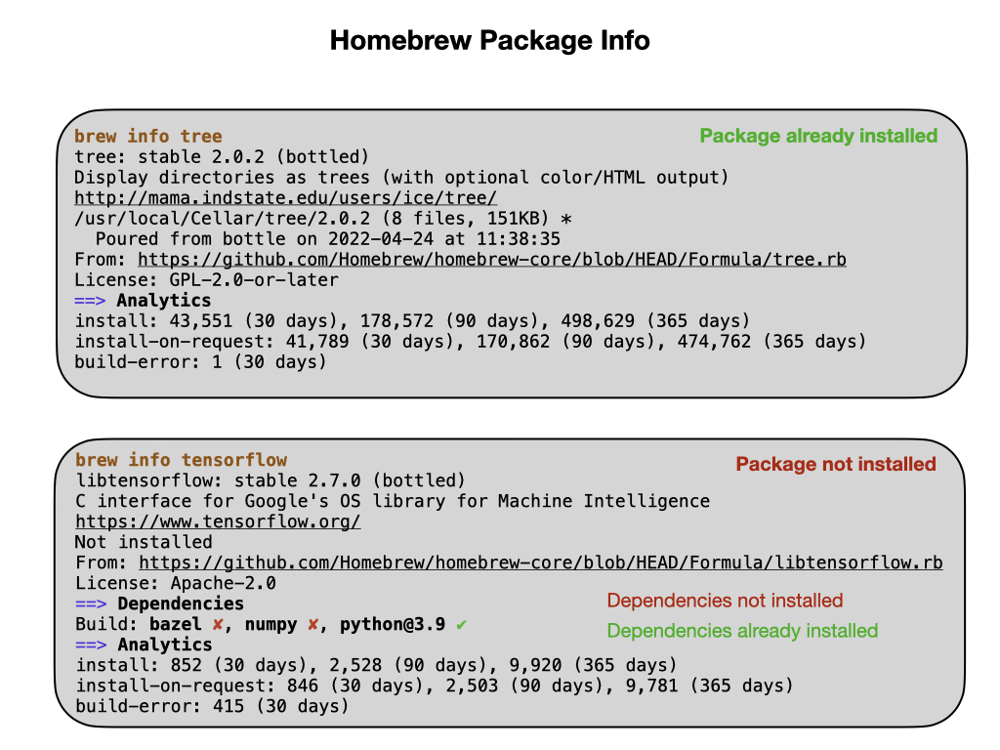

# Homebrew Package Manager (MacOS) 

See if brew is installed.  This will show the brew help menu if installed.

    brew help

## Installation
Must have xcode command lines tools installed:

    xcode-select --install

Install native M1 version of brew

    /bin/bash -c "$(curl -fsSL https://raw.githubusercontent.com/Homebrew/install/master/install.sh)"
    echo 'eval "$(/opt/homebrew/bin/brew shellenv)"' >> ~/.zprofile
    eval "$(/opt/homebrew/bin/brew shellenv)"

## Usage

Find a package:

    brew search <package name>

Package descriptions are on the [Homebrew](https://brew.sh) site.  A really useful one is `tree` that shows your directory structure.

    brew install tree

To uninstall:

    brew uninstall tree

Find what is installed:

    brew list

To find out which packages are outdated:

    brew outdated

To update:

    brew update

Remove outdated packages.  You should always do this before installing new packages:

    brew cleanup

Get information on a package.

    

## Installing Applications

You can install applications using brew instead of going to the application Website and downloading the `dmg` and installing. For example:

    brew install docker

This used to be done using the key word `cask`, but that is now deprecated.

Go to the application home page:

    brew home docker

## Directory Structure
Packages get installed in:

    /usr/local/Cellar

with a symbolic link from:

    /usr/local/bin

There are also directories

    /usr/local/Frameworks
    /usr/local/Casks
    /usr/local/Homebrew

## Troubleshooting
A useful command here is:

    brew doctor
    
#### Issue 1
If you get something like the following it means that deleted Docker recently and this was causing an error. 

    Error: Permission denied @ apply2files - /usr/local/lib/docker/cli-plugins

What I did to fix was to recreate a folder of the Docker app:

    mkdir -p /Applications/Docker.app/Contents/Resources/cli-plugins
    brew cleanup

#### Issue 2
Permissions errors like:

    could not cleanup old kegs fix your permissions...

To fix:

    sudo chown -R $(whoami) /usr/local/Cellar/python...

## References
- [Homebrew Package Manager](https://brew.sh)

- Very good [Homebrew Tutorial](https://www.youtube.com/watch?v=SELYgZvAZbU&ab_channel=CoreySchafer) - YouTube

- [Cheat Sheet](https://devhints.io/homebrew)